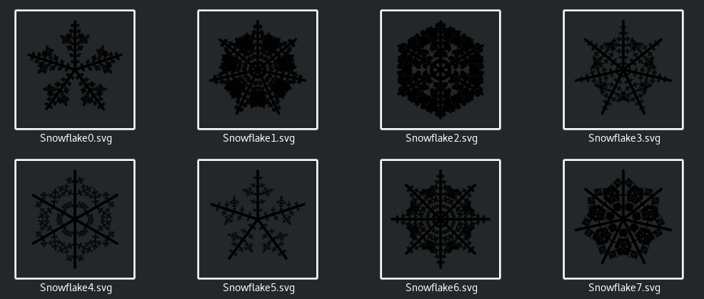

# Fractals
Three fractals generated into SVG

## Spiral
Variation of a binary tree fractal.

In each step the algorithm creates a new edge of the spiral and a new smaller spiral with opposite direction.

## Snowflakes
My second fractal: Randomly generated snowflakes.

Each wing of the snowflake is generated recursively: firstly, the longest subwing in the center is created and then the smaller subwings closer to the end of the wing with decreasing length.
Random factors: number of initial wings; number, angles, initial length and decreasing factor of subwings.

## Koch snowflake
Basic Koch snowflake.

